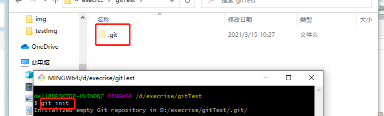
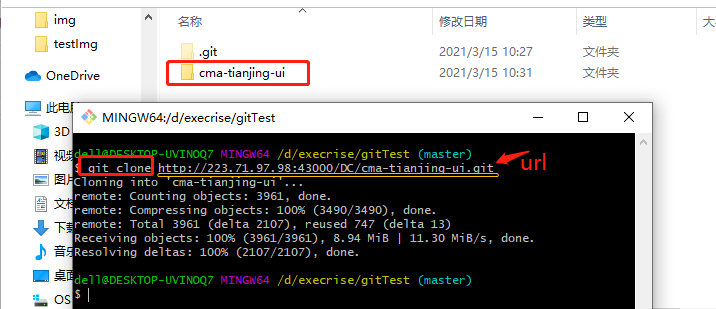
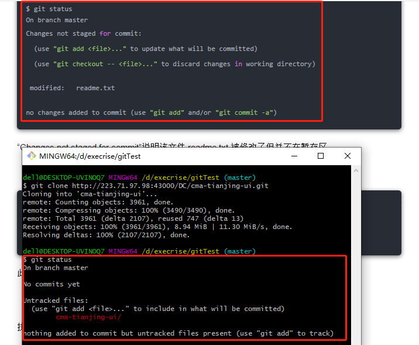
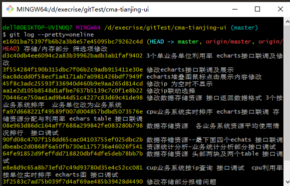
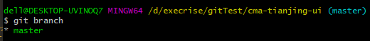

#一次完整的git使用过程

`1.创建版本库`
- 创建版本库
  选择一个文件目录，然后右击打开 git bash 命令行窗口，执行下述命令初始化一个本地仓库。
```
git init
```
- 该命令将创建一个名为 .git 的目录，这个目录是 Git 来跟踪管理版本的，没事千万不要手动乱改这个目录里面的文件，否则，会把 Git 仓库给破坏了。
- 

`2.获取远程仓库至本地仓库`
- ps：远程仓库的建立会再补充的，选择一个文件目录，然后右击打开 git bash 命令行窗口，从一个服务器上克隆一个 Git 远程仓库。
```
git clone [url] 
```

`3.记录每次更新到版本库`
- 如果是创建的版本库，此时，工作区中还是没有文件的，可以直接在工作区中新增并修改；如果是获取的版本库，直接修改工作区的内容就好了。
```
改动好之后，可执行下述几个命令：
①.检测当前文件状态。
git status
“Changes not staged for commit”说明该文件 readme.txt 被修改了但并不在暂存区。
②.把更改的内容添加到暂存区。
git add [filename]（针对特定文件）
git add *(所有文件)
git add *.txt（支持通配符，所有 .txt 文件）
```

`4.忽略文件`
- 执行 add 操作时，有些文件是不想要放到暂存区，就可以使用下面的方法忽略掉：
- 使用命令：touch .gitignore 创建 .gitignore 文件。
- 在文件中写入需要忽略的文件。
- 例如，写入 appName/src/test/* 表示忽略掉了 appName 项目下的 test 文件夹下的所有文件。

`5.提交更新`
```
把存放在暂存区的最新的代码，放到本地仓库中，
git commit -m "代码提交信息"
注意：每次准备提交前，先用 git status 看下，是不是都已暂存起来了，然后再运行提交命令
```
`6.跳过使用暂存区域提交更新的方式`
```
git commit -a -m "代码提交信息" //使用暂存区域而提交更新的命令
git commit 加上 -a 选项，Git 就会自动把所有已经跟踪过的文件暂存起来一并提交，从而跳过 git add 步骤
```
`7.查看工作区和版本库里面最新版本的区别`
```
git diff HEAD -- [filename]
```
`8.移除文件`
```
git rm [filename] //从暂存区移除某文件，然后提交更新本地仓库
```
`9.对文件重命名`
```
git mv README.*** README 
(这个命令相当于 mv README.*** README、git rm README.***、git add README 这三条命令的集合)`
```
`10.查看提交历史`
```
git log
//git log 会按提交时间列出所有的更新，最近的更新排在最上面。加上 --pretty=oneline 后输出的信息就不会那么多
```

`11.版本回退`
```
git reset --hard HEAD^ 回退到上一版本
git reset --hard HEAD^^ 回退到上上版本
git reset --hard HEAD~100 回退到前100个版本
git reset --hard [版本号] 回退到固定版本号
git reflog 记录每一次的命令（可以查看版本号）
```
`12.推送本地的改动到远程仓库，使本地仓库和远程仓库一致`
```
// 如果还没有克隆现有仓库，并想将你的仓库连接到某个远程服务器
·git remote add origin <url> 
// 如果已经关联了远程仓库，可以使用下述命令看一下远程仓库是哪个
git remote -v
// 将本地改动提交到远程仓库
git push origin [分支]
```
#####分支管理
`1.创建一个分支 dev`
```
git branch dev
git branch 后面不加分支的名字就是查看当前的分支
```

`2.切换当前分支到 dev`
```
git checkout dev 
```
`3.创建并切换分支`
```
git checkout -b dev   （两条命令的合写）
```
`4.切换到主分支`
```
git checkout master 
```
`5.合并 dev 分支到 master`
```
git merge dev
```
`6.把刚新建的分支删掉`
```
git branch -d dev 
```
`7.将分支推送到远端仓库（推送成功后其他人可见）`
```
git push origin [分支名]
```
- 这里可能会存在 push 失败的情况，那很可能就是因为你的另一个小伙伴和你修改了同一个文件的代码并且他 push 完成了，而你本次 push 的文件与远程仓库中现有的该文件产生了冲突，那需要先 pull 一下，再 push。
```
git pull 
ps: 如果失败了，根据提示，执行 git pull --set-upstream-to=origin/<branch> <branch>
就是说让你指定本地分支和远程分支的链接
```
